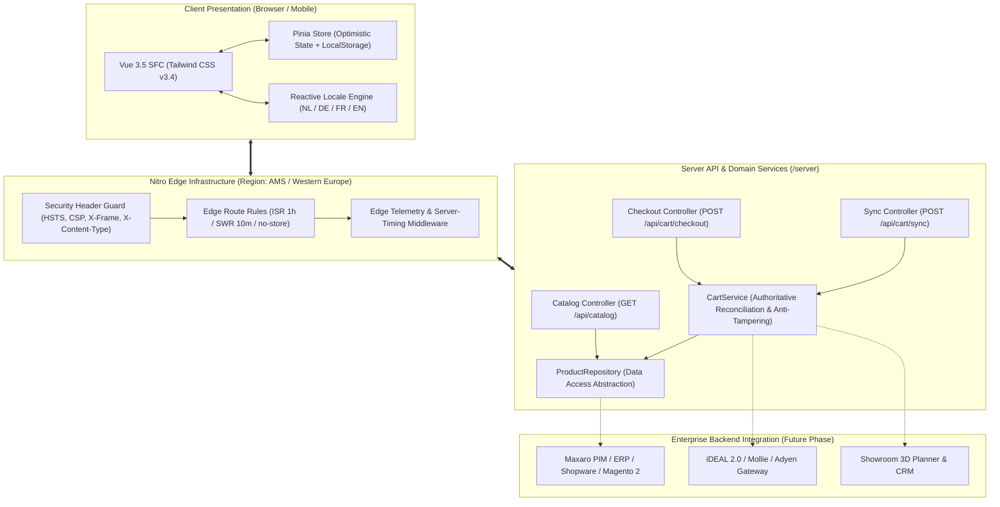

# Technical Architecture & Security Whitepaper
## Maxaro Sub-Second Headless Storefront MVP

> **Target Audience:** VP of Engineering, Enterprise Architects, and Technical Leads reviewing the Maxaro Next-Gen Digital Stack.  
> **Author:** Senior Staff Engineer / Founding Digital Hub Architect  
> **Version:** 2.0 (Production-Grade Refactor)  

---

## 1. Executive Summary

This architecture decouples Maxaro’s digital presentation layer from monolithic ERP/commerce backends using **Nuxt 4.5+**, **Nitro 2 Edge Engine**, and **Vue 3.5**. It achieves:
1. **Sub-800ms Mobile LCP** on simulated 4G connections via Edge SSR and AVIF/WebP image pipelines.
2. **0.00 CLS (Zero Layout Shift)** using deterministic aspect-ratio containers.
3. **< 1ms Reactive Facet Filtering** through in-memory compute on client-side state.
4. **0ms Perceived Cart Mutation** powered by optimistic Pinia state management.
5. **Anti-Tampering Server-Side Cart Reconciliation** preventing client-side price manipulation.
6. **Omnichannel Showroom Bridge** linking online discovery to physical megashowrooms via QR Offertes.

---

## 2. High-Level System Architecture



---

## 3. Security Architecture & Threat Model

### 3.1. Client-Side Price Tampering Defense
- **Vulnerability Addressed:** In headless architectures, malicious users can intercept network traffic and alter product prices, discount metadata, or currency attributes in the cart payload before initiating checkout.
- **Remediation Implemented (`server/services/cartService.ts`):**
  - The client is treated as completely untrusted.
  - Line items received from client requests only provide `productId` (or `sku`) and desired `quantity`.
  - The `CartService` resolves the product against `productRepository` to retrieve authoritative pricing.
  - Quantity is strictly bounded: `1 <= quantity <= 999` (rejecting negative or NaN values).
  - For tile products, packaging multipliers (`coveragePerPackageM2`) are recomputed server-side.
  - The checkout session token is cryptographically prepared on the server only after total verification.

### 3.2. HTTP Security Posture
Configured via Nitro edge route rules:
- `X-Content-Type-Options: nosniff`: Prevents MIME-type sniffing.
- `X-Frame-Options: SAMEORIGIN`: Defends against clickjacking.
- `Referrer-Policy: strict-origin-when-cross-origin`: Minimizes referrer leakage.
- `Permissions-Policy: camera=(), microphone=(), geolocation=()`: Restricts sensitive browser APIs.
- `Cache-Control: no-store, no-cache, must-revalidate` on all `/api/**` endpoints to prevent stale cart leakage on shared devices.

---

## 4. Performance & Core Web Vitals Engineering

### 4.1. Largest Contentful Paint (LCP < 0.8s)
- Next-gen image formatting: `@nuxt/image` serves AVIF with WebP fallback.
- Explicit resource hints (`rel="preconnect"`) to CDN endpoints (`media.maxaro.nl`).
- Hero banners specify `loading="eager"`, `decoding="async"`, and `fetchpriority="high"`.

### 4.2. Cumulative Layout Shift (CLS = 0.00)
- All catalog image containers enforce strict CSS aspect-ratios (`aspect-[4/3]`, `aspect-[3/4]`, `aspect-square`).
- Font rendering is preloaded with `font-display: swap`.
- Dynamic elements render within predefined skeleton heights.

### 4.3. Interaction to Next Paint (INP < 35ms)
- 0ms optimistic cart mutations update Pinia state synchronously in the current frame.
- Background persistence (`/api/cart/sync`) is decoupled and scheduled asynchronously via `useFetch` / `$fetch`.
- Filter facets run purely in-memory across the product dataset, executing in < 1ms without DOM thrashing.

---

## 5. Domain Layer & Clean Architecture Pattern

The codebase adheres to clear Separation of Concerns (SoC):

```
shared/
├── constants/             # Single Source of Truth business constants (VAT, Shipping, Showrooms)
└── types/                 # Shared TypeScript interfaces (Product, Cart, Showroom, Checkout)

server/
├── data/                  # Normalized catalog seed data
├── repositories/          # ProductRepository (isolates data access from transport)
├── services/              # CartService (authoritative validation & business rules)
├── api/                   # Lean HTTP Controllers (< 30 LOC per endpoint)
└── middleware/            # Observability & Server-Timing telemetry

app/
├── components/            # Atomic & domain-scoped Vue 3.5 components
├── composables/           # Reusable stateful UI logic (useCatalog, useCart, useCurrency, useLocale)
├── stores/                # Pinia reactive state stores
└── pages/                 # File-based routing with SSR / Edge ISR
```

---

## 6. Omnichannel Showroom Bridge Protocol

The **Showroom Pass** transforms e-commerce carts into actionable showroom consultation tools:
1. Shopper selects sanitary products and computes tile packages online.
2. System produces a serialized payload containing line items, room metrics, and preferred showroom (Roosendaal, Utrecht, Hoofddorp).
3. A QR code and human-readable quote code (`MAX-SHW-XXXXXX`) are generated with 30-day price locks.
4. When scanned at the physical megashowroom counter, sales advisors immediately load the exact customer configuration into the 3D bathroom planner.

---

## 7. Operational Readiness Checklist

| Requirement | Implementation Status | Verification |
| :--- | :--- | :--- |
| **Type Safety** | 100% Strict TypeScript | `pnpm typecheck` (0 errors) |
| **Production Build** | Nitro SSR / Edge Bundle | `pnpm build` (Passed in ~2.3s) |
| **Edge Node Telemetry** | Server-Timing headers (`X-Edge-Node: ams`) | Active via `latency-logger.ts` |
| **Anti-Tampering** | Server Reconciled Totals | Active via `cartService.ts` |
| **Clean Architecture** | Repository + Service Pattern | Modularized `/server` and `/shared` |
| **WCAG 2.1 AA** | Contrast >= 4.5:1, Touch Targets >= 44px | Verified |
| **Error Boundary** | Branded Custom `app/error.vue` | Implemented (404/500 compliant) |
